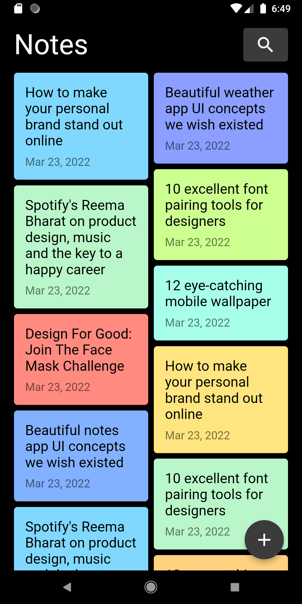
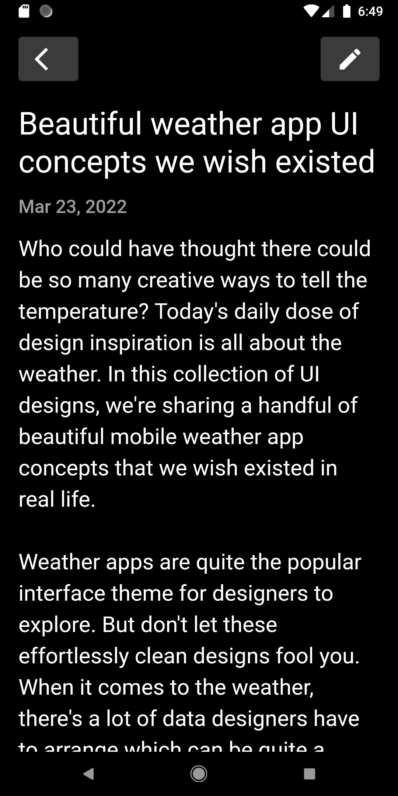
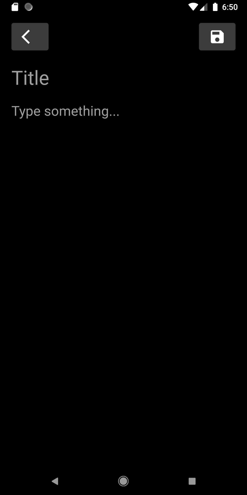
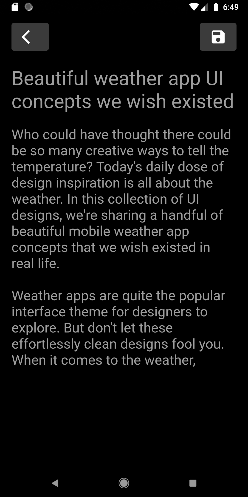
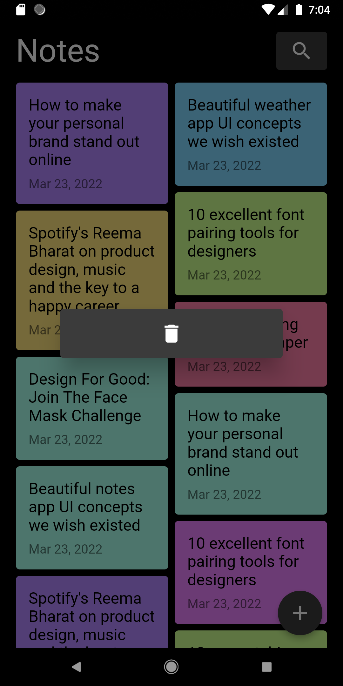
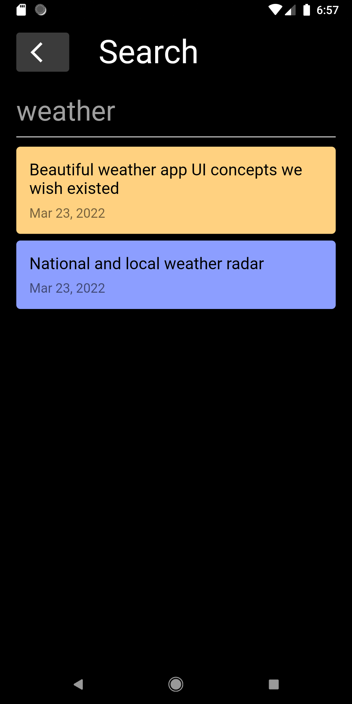

# notes_app

A simple notes app based on following concept:  
https://dribbble.com/shots/11875872-A-simple-and-lightweight-note-app

## Table of contents

- [Features](#features)
- [Screenshots](#screenshots)
- [Technologies](#technologies)
- [Setup](#setup)
- [Launch](#launch)
- [Test](#test)
- [Inspiration](#inspiration)

## Features

- Manage notes
  - Create
  - Update
  - Delete
- Search notes

## Screenshots

[](_screenshots/home.png)
[](_screenshots/note.png)
[](_screenshots/create.png)
[](_screenshots/update.png)
[](_screenshots/delete.png)
[](_screenshots/search.png)

## Technologies

- Dart
- Flutter
- SQLite

## Setup

Clone or download this repository.  
Use the following command to install all the dependencies:

```
flutter pub get
```

Use the following command to update to the latest compatible versions of all the dependencies :

```
flutter pub upgrade
```

Use the following command to create platform-specific folders:

```
flutter create .
```

## Launch

Run the application using your IDE or using the following command:

```
flutter run
```

## Test

Run the tests using your IDE or using the following command:

```
flutter test
```

## Inspiration

This application was based on [Amal](https://dribbble.com/amal) concept:  
https://dribbble.com/shots/11875872-A-simple-and-lightweight-note-app
