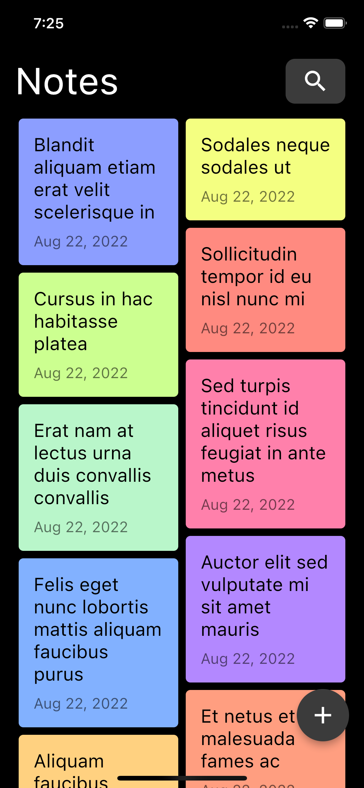
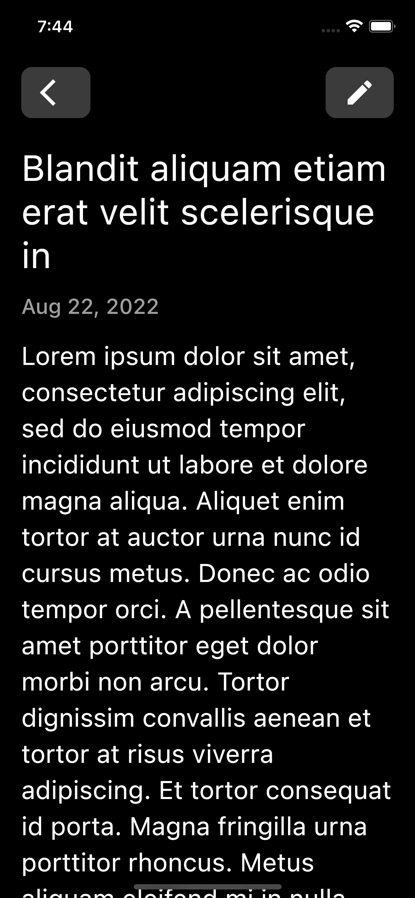
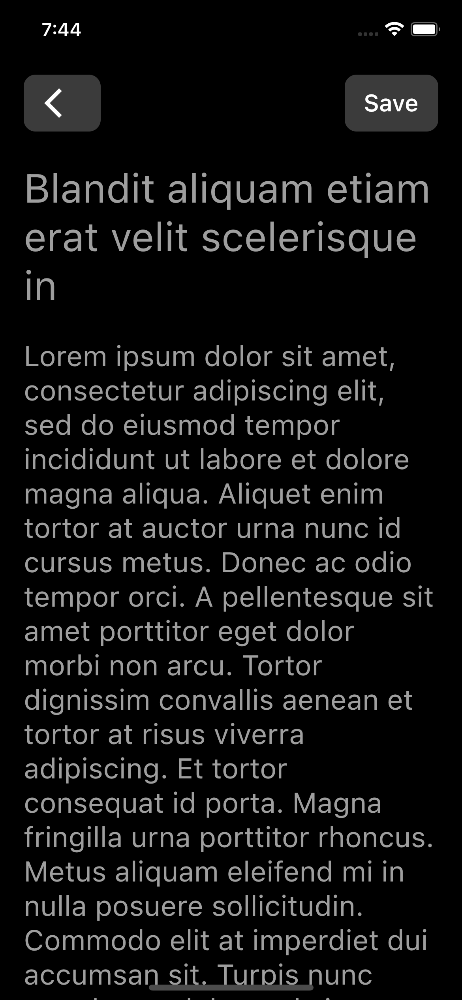
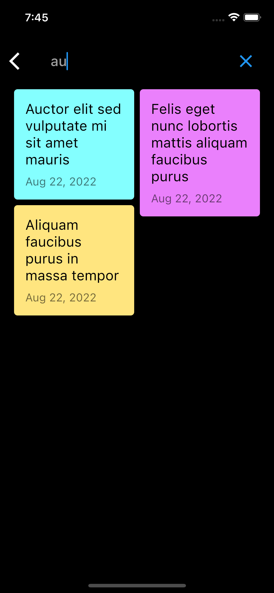
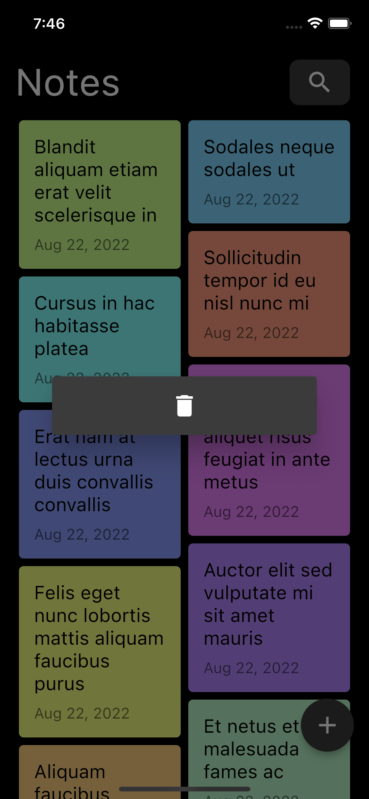
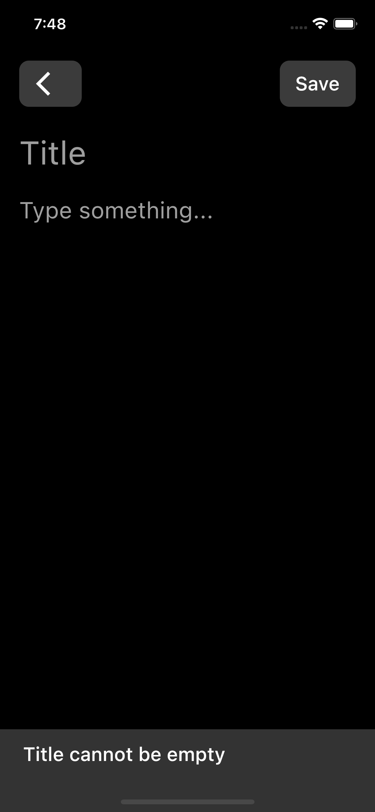

<a href="https://github.com/gzaber/notes_app/actions"></a>
<a href="https://codecov.io/gh/gzaber/notes_app"></a>
<a href="https://opensource.org/licenses/MIT"></a>

# notes_app

A simple notes app based on following concept:  
https://dribbble.com/shots/11875872-A-simple-and-lightweight-note-app

## Table of contents

- [Screenshots](#screenshots)
- [Features](#features)
- [Packages used](#packages-used)
- [Setup](#setup)
- [Test](#test)
- [Run](#run)

## Screenshots

[](.screenshots/notes_overview.png)
[](.screenshots/note.png)
[](.screenshots/manage_note_create.png)
[](.screenshots/manage_note_update.png)
[](.screenshots/search.png)
[](.screenshots/delete.png)
[](.screenshots/manage_note_error.png)

## Features

- create, update, delete note
- search notes by title
- supported locales: en, pl

## Packages used

- equatable
- flutter_bloc
- flutter_staggered_grid_view
- intl
- json_annotation
- sqflite
- uuid

## Setup

Clone or download this repository.  
Use the following command to install all the dependencies:

```
$ flutter pub get
```

## Test

Run the tests using your IDE or using the following command:

```
$ flutter test --coverage
```

For local packages run above command in package root directory.

## Run

Run the application using your IDE or using the following command:

```
$ flutter run
```
