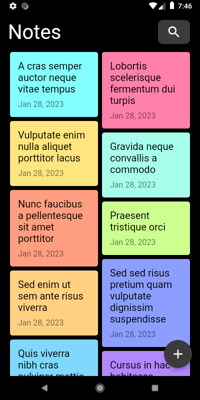
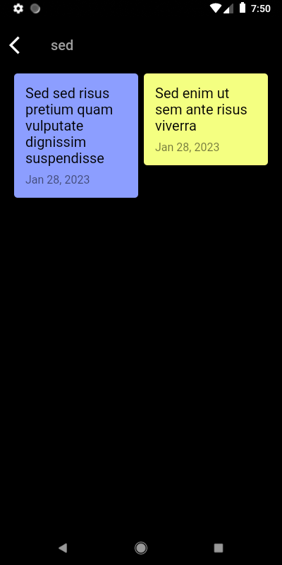
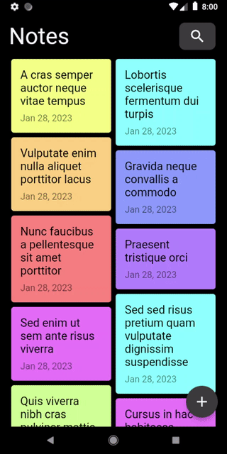
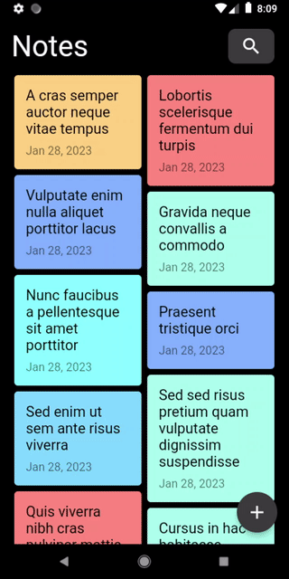
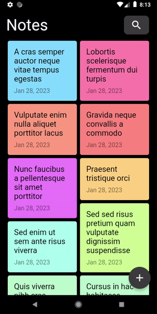

<a href="https://github.com/gzaber/notes_app/actions"></a>
<a href="https://codecov.io/gh/gzaber/notes_app"></a>
<a href="https://opensource.org/licenses/MIT"></a>

# notes_app

A simple notes app based on the following concept:  
https://dribbble.com/shots/11875872-A-simple-and-lightweight-note-app

## Table of contents

- [Screenshots](#screenshots)
- [Features](#features)
- [Packages used](#packages-used)
- [Setup](#setup)
- [Test](#test)
- [Run](#run)

## Screenshots

[](.screenshots/notes_overview_page.png)
&nbsp;
[](.screenshots/note_page.png)
&nbsp;
[](.screenshots/search_notes.png)

[](.screenshots/recording1.gif)
&nbsp;
[](.screenshots/recording2.gif)
&nbsp;
[](.screenshots/recording3.gif)

## Features

- create, update, delete note
- search notes by title
- supported locales: en, pl

## Packages used

- bloc
- json_annotation
- sqflite
- uuid

## Setup

Clone or download this repository.  
Use the following command to install all the dependencies:

```
$ flutter pub get
```

## Test

Run the tests using your IDE or using the following command:

```
$ flutter test --coverage
```

For local Flutter packages run the above command in the package root directory.  
For local Dart packages run the following commands in the package root directory:

```
$ dart pub global activate coverage
$ dart pub global run coverage:test_with_coverage
```

## Run

Run the application using your IDE or using the following command:

```
$ flutter run
```
